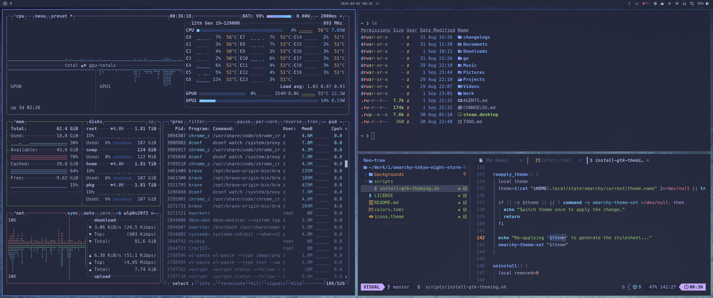

# Tokyo Night Storm

The Storm variant of Tokyo Night for Omarchy. Omarchy ships Tokyo Night in its Night variant; this is the same palette on Storm's lighter blue-gray background.

**For Omarchy 4 (Quattro).**



## Install

```bash
omarchy theme install https://github.com/ivanskodje/omarchy-tokyo-night-storm-theme.git
```

Then pick it in _Style > Theme_ (`Super + Space`), or run `omarchy theme set tokyo-night-storm`.

## Uninstall

```bash
omarchy theme remove tokyo-night-storm
```

Switch to another theme first (`Super + Space`); removing the active one leaves it applied until you do.

If you ran the GTK fix, undo it before removing the theme: `bash ~/.config/omarchy/themes/tokyo-night-storm/scripts/install-gtk-theming.sh --uninstall`. Wallpapers you added to `~/.config/omarchy/backgrounds/tokyo-night-storm/` are left alone.

## Backgrounds

Add (or remove) your own to `~/.config/omarchy/backgrounds/tokyo-night-storm/` and they show up in the same background picker cycle (`Super + Ctrl + Space`).

## OPTIONAL: Files (Nautilus) and other GTK apps

**Omarchy does not theme GTK apps**. Nautilus (the default file manager) takes its colors from libadwaita, which ignores the GTK theme setting by design, so it looks the same under every Omarchy theme, this one included. 
(Hopefully it will be fixed some day so we dont need multiple configs [#8408](https://github.com/omacom/omarchy/pull/8408).)

HOWEVER; If you are tired of waiting, [scripts/install-gtk-theming.sh](scripts/install-gtk-theming.sh) applies a fix that follows whatever theme you switch to. Read the script before running it!

Apply it:

```bash
bash ~/.config/omarchy/themes/tokyo-night-storm/scripts/install-gtk-theming.sh
```

Apply it, and restart Files on every theme switch:

```bash
bash ~/.config/omarchy/themes/tokyo-night-storm/scripts/install-gtk-theming.sh --auto-restart-files
```

If you don't like the behavior of Files closing whenever you change theme, you can disable it again:

```bash
rm ~/.config/omarchy/hooks/theme-set.d/restart-files
```

Remove it:

```bash
bash ~/.config/omarchy/themes/tokyo-night-storm/scripts/install-gtk-theming.sh --uninstall
```

GTK3 apps are not covered. Without `--auto-restart-files`, restart Files yourself (`pkill -x nautilus`) for a theme change to show up.

## Credits

Tokyo Night is by [enkia](https://github.com/enkia/tokyo-night-vscode-theme). The palette values here come from [folke/tokyonight.nvim](https://github.com/folke/tokyonight.nvim).

The three backgrounds included are AI generated, so they carry no copyright. Everything else here is MIT.
